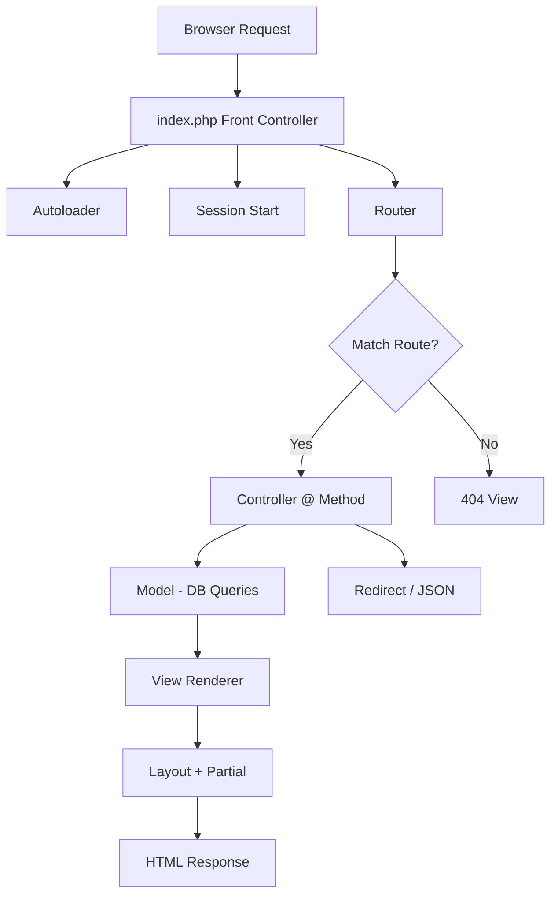

# MVC Framework Plan — Consultoría Ambiental

## Overview

Convert the current static HTML site into a **pure PHP MVC framework** with routing, models, views, controllers, and an admin panel for managing blog posts and services. The front-end will use **Tailwind CSS** (CDN for now) and the existing design.

---

## 1. Directory Structure

```
consultoriaambiental/
├── index.php                 # Front controller — all requests enter here
├── .htaccess                 # Apache rewrite rules (if deploying to Apache)
├── config/
│   ├── database.php          # DB connection config
│   ├── app.php               # App constants (BASE_URL, etc.)
│   └── init.php              # Bootstrap file (autoloader, session start, etc.)
├── public/
│   ├── css/                  # (optional) custom CSS files
│   ├── js/                   # (optional) custom JS files
│   └── images/               # Move existing images/ here
├── app/
│   ├── core/
│   │   ├── Router.php        # Simple routing engine
│   │   ├── Controller.php    # Base controller
│   │   ├── Model.php         # Base model (PDO wrapper)
│   │   └── View.php          # View renderer with layout support
│   ├── controllers/
│   │   ├── HomeController.php
│   │   ├── BlogController.php
│   │   ├── ServiceController.php
│   │   └── Admin/
│   │       ├── AuthController.php
│   │       ├── DashboardController.php
│   │       ├── BlogController.php
│   │       └── ServiceController.php
│   ├── models/
│   │   ├── User.php
│   │   ├── BlogPost.php
│   │   └── Service.php
│   └── views/
│       ├── layouts/
│       │   ├── main.php          # Public site layout (header, footer, nav)
│       │   └── admin.php         # Admin layout (sidebar, topbar)
│       ├── home/
│       │   └── index.php         # Hero section, services preview, etc.
│       ├── blog/
│       │   ├── index.php         # Blog listing
│       │   └── show.php          # Single blog post
│       ├── servicios/
│       │   ├── index.php         # Services listing
│       │   └── show.php          # Single service detail
│       ├── partials/
│       │   ├── navbar.php
│       │   ├── footer.php
│       │   ├── hero.php
│       │   └── admin/
│       │       ├── sidebar.php
│       │       └── topbar.php
│       └── admin/
│           ├── login.php
│           ├── dashboard.php
│           ├── blog/
│           │   ├── index.php     # Blog list (CRUD table)
│           │   ├── create.php    # Create blog form
│           │   └── edit.php      # Edit blog form
│           └── servicios/
│               ├── index.php
│               ├── create.php
│               └── edit.php
├── migrations/
│   └── 001_initial.sql       # Database schema
└── storage/
    └── logs/                 # Error logs
```

---

## 2. Core Framework Components

### 2.1 Front Controller (`index.php`)

- Sets up autoloading (PSR-4 style via `spl_autoload_register`)
- Loads config, starts session
- Instantiates `Router` and dispatches the request

### 2.2 Router (`app/core/Router.php`)

- Simple regex-based router
- Supports `GET` and `POST` methods
- Maps URLs to `Controller@method`
- Example routes:

| Method | URL Pattern | Controller@Method |
|--------|-------------|-------------------|
| GET | `/` | `HomeController@index` |
| GET | `/blog` | `BlogController@index` |
| GET | `/blog/{slug}` | `BlogController@show` |
| GET | `/servicios` | `ServiceController@index` |
| GET | `/servicios/{slug}` | `ServiceController@show` |
| GET | `/admin` | `Admin\DashboardController@index` |
| GET | `/admin/login` | `Admin\AuthController@loginForm` |
| POST | `/admin/login` | `Admin\AuthController@login` |
| GET | `/admin/logout` | `Admin\AuthController@logout` |
| GET | `/admin/blog` | `Admin\BlogController@index` |
| GET | `/admin/blog/crear` | `Admin\BlogController@create` |
| POST | `/admin/blog/crear` | `Admin\BlogController@store` |
| GET | `/admin/blog/editar/{id}` | `Admin\BlogController@edit` |
| POST | `/admin/blog/editar/{id}` | `Admin\BlogController@update` |
| POST | `/admin/blog/eliminar/{id}` | `Admin\BlogController@destroy` |
| GET | `/admin/servicios` | `Admin\ServiceController@index` |
| GET | `/admin/servicios/crear` | `Admin\ServiceController@create` |
| POST | `/admin/servicios/crear` | `Admin\ServiceController@store` |
| GET | `/admin/servicios/editar/{id}` | `Admin\ServiceController@edit` |
| POST | `/admin/servicios/editar/{id}` | `Admin\ServiceController@update` |
| POST | `/admin/servicios/eliminar/{id}` | `Admin\ServiceController@destroy` |

### 2.3 Base Controller (`app/core/Controller.php`)

- Provides helper methods:
  - `view(string $view, array $data)` — renders a view with layout
  - `redirect(string $url)` — HTTP redirect
  - `json(array $data)` — JSON response for AJAX

### 2.4 Base Model (`app/core/Model.php`)

- PDO wrapper with prepared statements
- Methods: `query()`, `fetch()`, `fetchAll()`, `insert()`, `update()`, `delete()`
- Uses MySQL connection from config

### 2.5 View Renderer (`app/core/View.php`)

- Renders PHP view files with extracted data
- Supports layouts (wraps content in `layouts/main.php` or `layouts/admin.php`)
- Passes `$title` variable for dynamic `<title>` tags

---

## 3. Database Schema

### Tables

```sql
-- users (admin login)
CREATE TABLE users (
    id INT AUTO_INCREMENT PRIMARY KEY,
    username VARCHAR(50) UNIQUE NOT NULL,
    email VARCHAR(100) UNIQUE NOT NULL,
    password VARCHAR(255) NOT NULL,  -- bcrypt hash
    created_at TIMESTAMP DEFAULT CURRENT_TIMESTAMP
);

-- blog_posts
CREATE TABLE blog_posts (
    id INT AUTO_INCREMENT PRIMARY KEY,
    title VARCHAR(255) NOT NULL,
    slug VARCHAR(255) UNIQUE NOT NULL,
    excerpt TEXT,
    content TEXT NOT NULL,
    featured_image VARCHAR(255),
    published BOOLEAN DEFAULT FALSE,
    created_at TIMESTAMP DEFAULT CURRENT_TIMESTAMP,
    updated_at TIMESTAMP DEFAULT CURRENT_TIMESTAMP ON UPDATE CURRENT_TIMESTAMP
);

-- services
CREATE TABLE services (
    id INT AUTO_INCREMENT PRIMARY KEY,
    title VARCHAR(255) NOT NULL,
    slug VARCHAR(255) UNIQUE NOT NULL,
    description TEXT,
    icon VARCHAR(100),  -- FontAwesome class, e.g., "fas fa-leaf"
    content TEXT,
    published BOOLEAN DEFAULT TRUE,
    sort_order INT DEFAULT 0,
    created_at TIMESTAMP DEFAULT CURRENT_TIMESTAMP,
    updated_at TIMESTAMP DEFAULT CURRENT_TIMESTAMP ON UPDATE CURRENT_TIMESTAMP
);
```

---

## 4. Public Site Pages (Front-end)

Each page will be a **view file** that receives data from its controller. The existing HTML/CSS from `consultor_a_ambiental_home.html` will be split into:

| View File | Content Source |
|-----------|---------------|
| `views/layouts/main.php` | Navbar + footer wrapper (from existing HTML) |
| `views/partials/navbar.php` | Navigation bar (lines 71-105) |
| `views/partials/hero.php` | Hero section (lines 107-142) |
| `views/partials/footer.php` | Footer section |
| `views/home/index.php` | Homepage content (services, about, etc.) |
| `views/blog/index.php` | Blog listing page |
| `views/blog/show.php` | Single blog post |
| `views/servicios/index.php` | Services listing |
| `views/servicios/show.php` | Single service detail |

**Tailwind CSS** will remain via CDN (`cdn.tailwindcss.com`) for simplicity. The custom Tailwind config (colors, fonts) will be inlined in `<head>` as it is now.

---

## 5. Admin Panel

### 5.1 Authentication

- Login page at `/admin/login`
- Session-based auth using `$_SESSION`
- Password hashing with `password_hash()` / `password_verify()` (bcrypt)
- Middleware check in admin controllers: redirect to login if not authenticated

### 5.2 Admin Layout

- Sidebar with navigation: Dashboard, Blog (CRUD), Servicios (CRUD), Logout
- Top bar with user info
- Content area for each CRUD

### 5.3 CRUD Operations

**Blog Posts:**
- List all posts with status (published/draft), edit/delete actions
- Create form: title, slug (auto-generated), excerpt, content (textarea), featured image URL, published toggle
- Edit form: same fields pre-filled
- Delete with confirmation

**Services:**
- List all services with sort order, edit/delete actions
- Create form: title, slug, description, icon picker, content, published toggle, sort order
- Edit form: same fields pre-filled
- Delete with confirmation

---

## 6. Development Server

Run locally with PHP's built-in server:

```bash
php -S localhost:8000 -t public/
```

The `index.php` front controller will be in the project root, so we'll use a router file for the built-in server:

```bash
php -S localhost:8000 index.php
```

---

## 7. Implementation Order

| Step | Task | Description |
|------|------|-------------|
| 1 | Project scaffolding | Create directory structure, config files, autoloader |
| 2 | Core framework | Router, Controller, Model, View base classes |
| 3 | Database setup | Create MySQL database, run migration, seed admin user |
| 4 | Public site layout | Split existing HTML into layout, partials, and home view |
| 5 | Home page controller | HomeController with dynamic data from DB |
| 6 | Blog module (front) | BlogController, BlogPost model, blog views |
| 7 | Services module (front) | ServiceController, Service model, services views |
| 8 | Admin auth | Login/logout, session management |
| 9 | Admin layout | Admin layout with sidebar, topbar |
| 10 | Admin blog CRUD | Full CRUD for blog posts |
| 11 | Admin services CRUD | Full CRUD for services |
| 12 | Polish & testing | Test all routes, ensure existing design is preserved |

---

## 8. Architecture Diagram



```mermaid
flowchart TD
    subgraph Admin_Flow
        A1[/admin/login] --> A2[AuthController@login]
        A2 --> A3{Valid Credentials?}
        A3 -->|Yes| A4[Set Session]
        A3 -->|No| A5[Login Form + Error]
        A4 --> A6[/admin/dashboard]
        A6 --> A7[Admin Layout]
        A7 --> A8[Blog CRUD]
        A7 --> A9[Services CRUD]
        A8 --> A10[BlogController@index/create/edit/delete]
        A9 --> A11[ServiceController@index/create/edit/delete]
    end
```

---

## 9. Key Design Decisions

1. **No Composer dependencies** — pure PHP to keep it lightweight and easy to deploy on any shared hosting.
2. **PSR-4 style autoloading** — manual `spl_autoload_register` mapping `App\` namespace to `app/` directory.
3. **Tailwind via CDN** — no build step needed; the existing config inline in `<head>` continues to work.
4. **No JavaScript framework** — vanilla JS for admin interactions (confirm dialogs, form validation).
5. **Slug-based URLs** for blog and services (SEO friendly).
6. **Session-based auth** — simple and sufficient for a single-admin panel.
